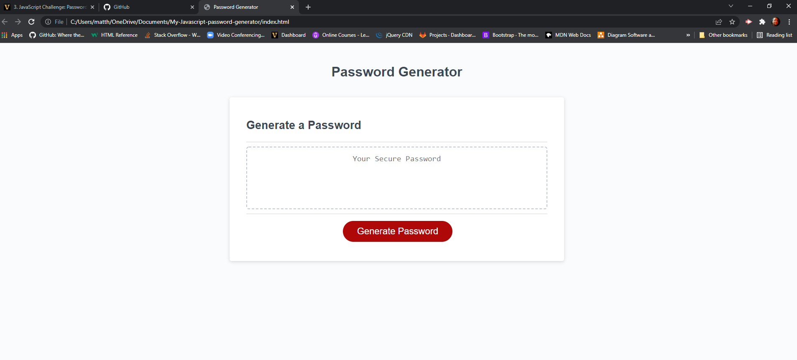

# My Javascript password generator
 This is a Javascript based password generator for the week 3 challenge.
 ## Purpose 
 This is designed to prompt and create a password by generating random numbers based on user interface.
 ## Built with 
 *HTML
 *CSS
 *JAVASCRIPT
 ## Website

 ## Contribution
 Made by Matthew L. Boisse @ matthewboisse@gmail.com 
